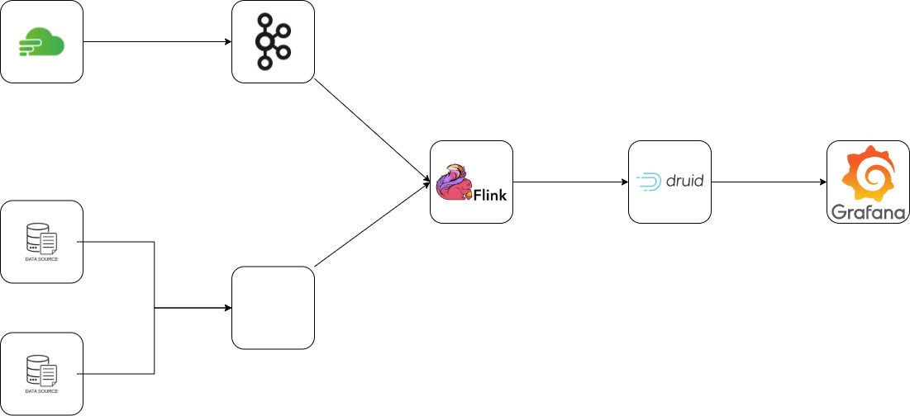
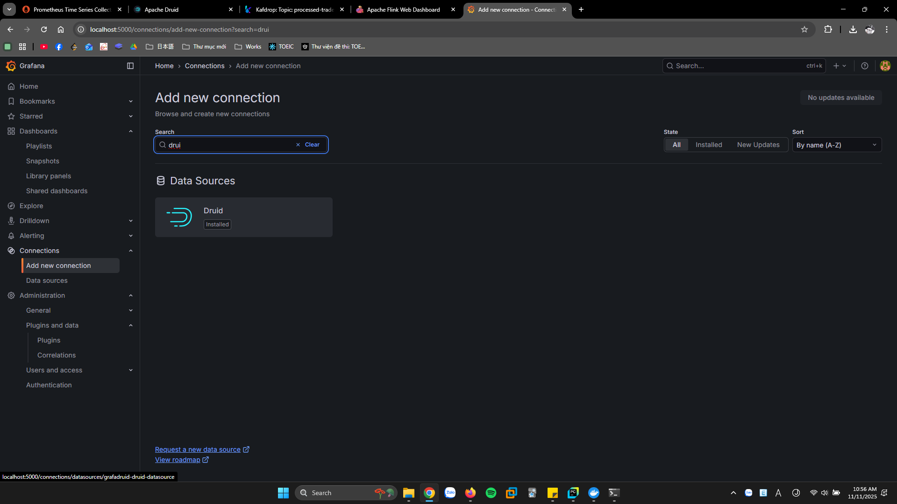
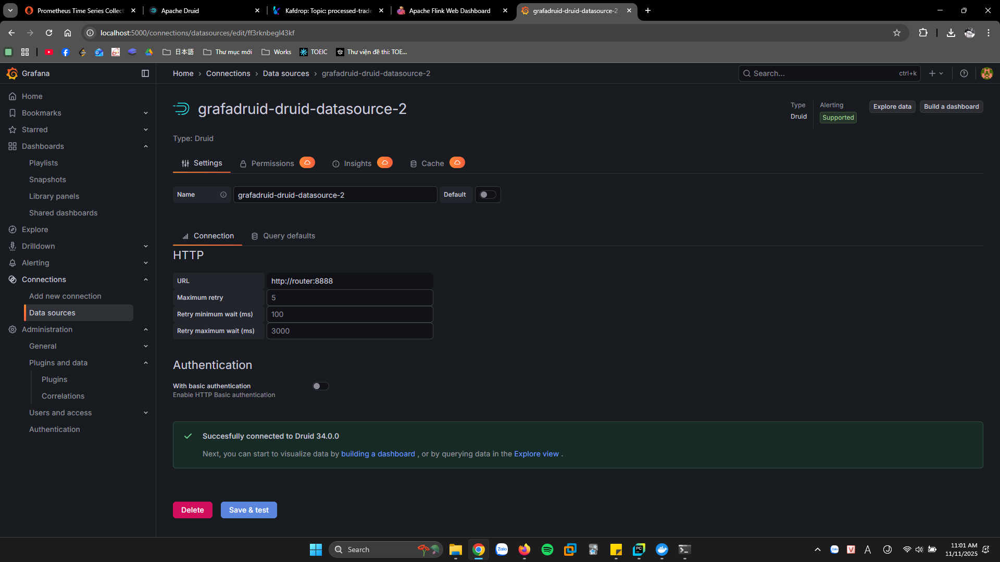
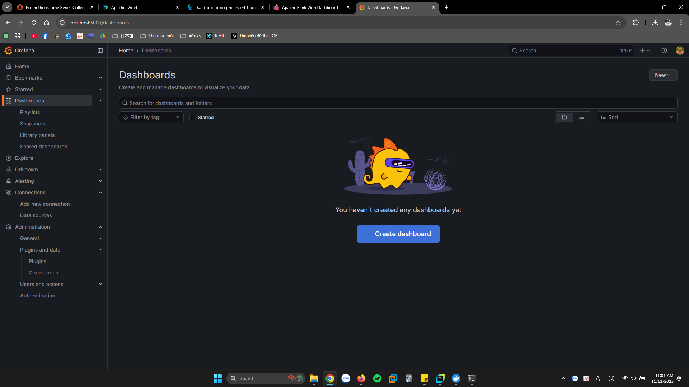
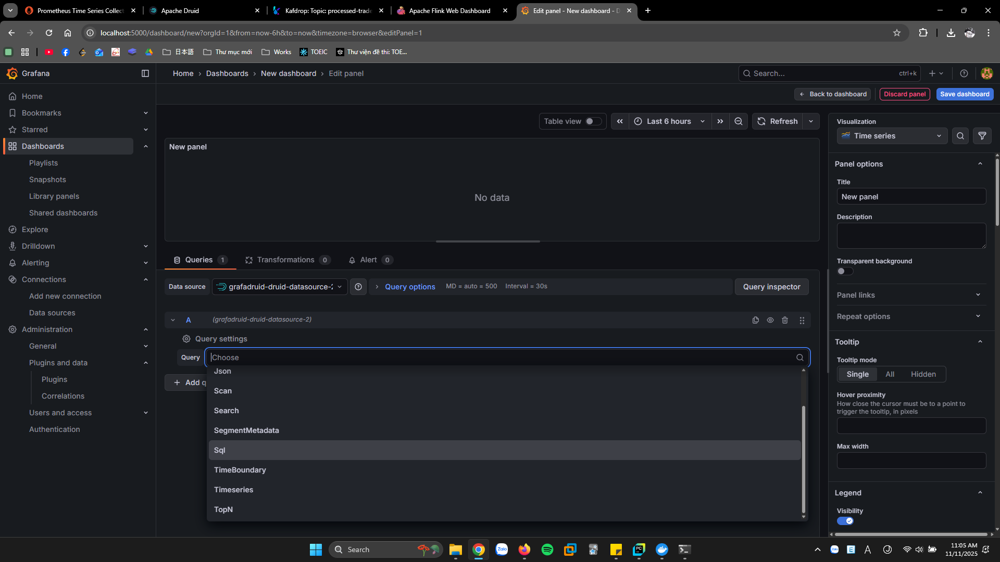

## Kiến trúc

## Các bước thực hiện
1. Clone repository về
2. Trong file env tạo 1 biến `FINHUB_TOKEN=<token của finhub>` 
3. Nén 2 folder `services` và `utils` lại thành file `mylibs.zip`
4. `docker-compose up -d`
5. `docker exec -it jobmanager bash`
6. `flink run -py /opt/flink/jobs/main_transform.py -pyFiles /opt/flink/jobs/mylibs.zip`

## Cách setup các dashboard
1. Tạo connection
Vào `Connections` -> `Add new connection` -> tìm `Druid`

Chọn `Add datasource`

Điền `http://router:8888` và bấm `Save and test`

2. Tạo Dashboard
+ Vào `Dashboard` -> `Create dashboard`

+ `Add visualization` -> chọn cái druid vừa tạo

+ Chọn `SQL`

+ Điền lệnh `SELECT "__time", "price" AS "AAPL"
FROM "trade"
WHERE "symbol" = 'AAPL'` và tương tự với các mã còn lại
+ Bấm `Save dashboard` 2 lần